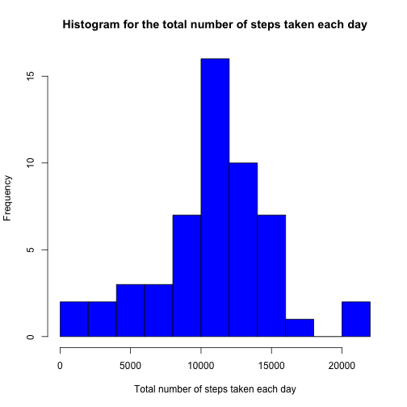
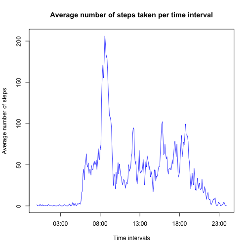
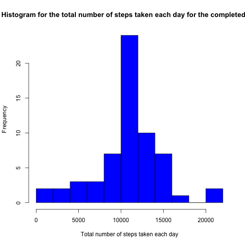

## Loading and preprocessing the data
The first step for this peer assessment is be the loading and preprocessing of the data (if needed). Please, keep in mind here that I'm assuming that the markdown file is in the same directory as the zipped data file. If this is not the case, the code chunks will not run properly.

After forking and clonning the repository, the data will be in a zipped file called *activity.zip*. Thus, we need to unzip the file in order to read it properly. I will use *unz* for this. Besides, I'm using variables to store the names of the files, as this allow me to re-use code chunks for similar problems. 


```r
zipFilePath <- "./activity.zip"
csvFileName <- "activity.csv"
unzippedFile <- unz(zipFilePath, csvFileName)
rawActData <- read.csv(unzippedFile)
```

After loading the data, we can take a kick look at how the data looks like. For example, we can see the head of the dataset:


```r
head(rawActData)
```

```
##   steps       date interval
## 1    NA 2012-10-01        0
## 2    NA 2012-10-01        5
## 3    NA 2012-10-01       10
## 4    NA 2012-10-01       15
## 5    NA 2012-10-01       20
## 6    NA 2012-10-01       25
```

And, since we see some *NAs* in there, we can use *summary* in order to have some information about relevant parameters about the data:


```r
summary(rawActData)
```

```
##      steps                date          interval     
##  Min.   :  0.00   2012-10-01:  288   Min.   :   0.0  
##  1st Qu.:  0.00   2012-10-02:  288   1st Qu.: 588.8  
##  Median :  0.00   2012-10-03:  288   Median :1177.5  
##  Mean   : 37.38   2012-10-04:  288   Mean   :1177.5  
##  3rd Qu.: 12.00   2012-10-05:  288   3rd Qu.:1766.2  
##  Max.   :806.00   2012-10-06:  288   Max.   :2355.0  
##  NA's   :2304     (Other)   :15840
```

With this, we have a clear idea about how the data like, and we can move forward to the next step of the processing, which is calculating the mean total number of steps taken per day. No pre-processing has been needed, since the data seems to be in a pretty good shape. 

## What is mean total number of steps taken per day?
In order to get the mean total number of steps taken per day, I will follow the instructions in the description of the assessment. Besides, I will also ignore the missing values in the dataset.

1. Calculate the total number of steps taken per day: 
I'll use some of the functions that are available in the dplyr library, thus, I need to load this library first in order to make use of them. After that I will use a combination of summarise and group_by to get the total number of steps taken per day. Finally, I will use more 'friendly' names for the data.frame containing the total number of steps per day, so it can be used later to calculate the histogram. Again, I show the head of the data.frame with the total steps per day to see how it looks like.


```r
library(dplyr)
totalStepsByDay <- summarise(group_by(rawActData,date),sum(steps))
names(totalStepsByDay) <- c("date","steps")
head(totalStepsByDay)
```

```
## Source: local data frame [6 x 2]
## 
##         date steps
## 1 2012-10-01    NA
## 2 2012-10-02   126
## 3 2012-10-03 11352
## 4 2012-10-04 12116
## 5 2012-10-05 13294
## 6 2012-10-06 15420
```


2. The next step is to make a histogram of the total number of steps taken each day
For this, I only need to plot the histogram of the total steps taken each day, usign *hist*. I've used 10 breaks since this value allows a clean representation of the histogram. Besides, I've used colors and put a nice main title and xaxis title, so the figure is more readable. I will use the base plotting system since it gives good enough results.


```r
hist(totalStepsByDay$steps,10, col="blue", main = "Histogram for the total number of steps taken each day", xlab="Total number of steps taken each day")
```

 

3. After we have the histogram, we calcualte the mean and median of the total number of steps taken per day, usign standard R functions. As it was indicated in the assessment instructions, I'm ignoring the missing values in the dataset for now, so I'll set the *na.rm* parameter to TRUE in both cases

To calculate the mean and the median of the total number of steps taken per day, I'll use the following R calls: 

```r
meanTotSteps <- mean(totalStepsByDay$steps, na.rm=TRUE)
medianTotSteps <- median(totalStepsByDay$steps, na.rm=TRUE)
```

After this code has been executed, the resulting values are 10766.19 for the mean and 10765 for the median. 

## What is the average daily activity pattern?
To calculate the average daily activity pattern, I'll follow the steps indicated in the asssessment description: 

1. I'm making a time series plot of the 5-minute interval and the average number of steps taken, averaged across all days. To get this plot, I need to get the average number of steps taken across all days. As a previous step here, I need to remove the NAs, since they won't allow me to calculate the mean for each interval (this wasn't needed in the first scenario, as we were adding up the values). There are NAs only in the steps values. Thus, I'll get a 'clean' dataset using only the complete cases and ignore the NAs by removing them. Once I have the clean dataset, I just group the values by interval and summarise usign the mean. Finally, I just use prettier names and print the head of the resulting data frame to see how it looks like:


```r
cleanActData <- rawActData[complete.cases(rawActData),]
cleanAvgStepsByInterval <- summarise(group_by(cleanActData,interval),mean(steps))
names(cleanAvgStepsByInterval) <- c("interval","steps")
head(cleanAvgStepsByInterval)
```

```
## Source: local data frame [6 x 2]
## 
##   interval     steps
## 1        0 1.7169811
## 2        5 0.3396226
## 3       10 0.1320755
## 4       15 0.1509434
## 5       20 0.0754717
## 6       25 2.0943396
```

Once I have the dataset, I plot it. Since the intervals ae not exactly in a time-series like format, I perform some transformation first, so the X axis shows hours of the day, instead the raw interval values. A base plot is enough here.


```r
times <- strptime(sprintf("%04d", cleanAvgStepsByInterval$interval), format="%H%M",tz="GMT")
plot(times,cleanAvgStepsByInterval$steps,type="l", col="blue", xlab="Time intervals", ylab="Average number of steps", main="Average number of steps taken per time interval")
```

 

2. Which 5-minute interval, on average across all the days in the dataset, contains the maximum number of steps?
This question can be easily answered by just calculating the maximum of the steps and see which is the corresponding interval. By simple inspection of the plot above, we can infer this maximum should be between 8:00 and 9:00 in the morning, but we will obtain the rigth time interval by using the following code:


```r
cleanAvgStepsByInterval[which(cleanAvgStepsByInterval$steps == max(cleanAvgStepsByInterval$steps)),]$interval
```

```
## [1] 835
```
 
Thus, the 5-minute interval which on average contains the maximum number of steps is the 08:35 one, which confirms that our assumption by looking at the figure was right. Note that I've used some text conversions here to write the interval in a HH:MM way. To do this, I've used the following code snippet:


```r
gsub('^([0-9]{2})([0-9]+)$', '\\1:\\2',sprintf("%04d", cleanAvgStepsByInterval[which(cleanAvgStepsByInterval$steps == max(cleanAvgStepsByInterval$steps)),]$interval))
```

```
## [1] "08:35"
```

## Imputing missing values
The first thing I need to do here is to calculate the number of missing values in the dataset. By inspectioning the dataset and using is.na (for example), we can detect that there are missing values only in the steps column of the dataset. I will use this for the first step:

1. Calculate and report the total number of missing values in the dataset (i.e. the total number of rows with NAs)

```r
missingValues <- is.na(rawActData$steps)
numMissing <- sum(missingValues)
```
Thus, the number of missing values is 2304.

After this number has been calculated, I go to the next step: 

2. Devise a strategy for filling in all of the missing values in the dataset. 
The strategy I'll use here is to use the mean of the corresponding 5-minutes interval to complete the missing values, which seems a reasonable approach, and, since we have these values calculated from the previous steps, I only need to make the transformations to create the new dataset. 

3. Create a new dataset that is equal to the original dataset but with the missing data filled in.
To do this, I've used a combination of mutate and replace as follows:


```r
completedData <- mutate(rawActData, steps = replace(rawActData$steps, missingValues, cleanAvgStepsByInterval$steps))
```

Then, we can observate how the NAs have been replaced by the mean interval values:


```r
head(completedData)
```

```
##       steps       date interval
## 1 1.7169811 2012-10-01        0
## 2 0.3396226 2012-10-01        5
## 3 0.1320755 2012-10-01       10
## 4 0.1509434 2012-10-01       15
## 5 0.0754717 2012-10-01       20
## 6 2.0943396 2012-10-01       25
```

The last step for this part of the exercise is:
4. Make a histogram of the total number of steps taken each day and calculate the **mean** and the **median** total number of steps taken per day

To make the histogram, I will use the following code to get the data usign the same approach as in the mean total number of steps taken section:

```r
totalCompletedStepsByDay <- summarise(group_by(completedData,date),sum(steps))
names(totalCompletedStepsByDay) <- c("date","steps")
head(totalCompletedStepsByDay)
```

```
## Source: local data frame [6 x 2]
## 
##         date    steps
## 1 2012-10-01 10766.19
## 2 2012-10-02   126.00
## 3 2012-10-03 11352.00
## 4 2012-10-04 12116.00
## 5 2012-10-05 13294.00
## 6 2012-10-06 15420.00
```

And, once I have the data, I can build the histogram by using the base plot system like this:

```r
hist(totalCompletedStepsByDay$steps,10, col="blue", main = "Histogram for the total number of steps taken each day for the completed set", xlab="Total number of steps taken each day")
```

 

Once the histogram is plotted, I calculate the mean and median values for the total number of steps taken per day with the following code: 

```r
meanTotCompletedSteps <- mean(totalCompletedStepsByDay$steps)
medianTotCompletedSteps <- median(totalCompletedStepsByDay$steps)
```

I've obtained a value of 1.0766189 &times; 10<sup>4</sup>for the mean and a value of 1.0766189 &times; 10<sup>4</sup>for the median. As you can see, the mean is exactly the same as for the estimates in the first part of the exercise while the median is slightly different. Besides, the histogram shape is similar, but the box for the central values is larger (which is totally reasonable). Thus no large impact is obtained by imputting missing data for this scenario. 


## Are there differences in activity patterns between weekdays and weekends?
To answer this question, I'll follow the steps indicated in the assessment description:
1. Create a new factor variable in the dataset with two levels – “weekday” and “weekend” indicating whether a given date is a weekday or weekend day.

As indicated, I'll use the *weekday* function, combined with *ifelse*, so I can substitute the right values. Besides, I'll use *mutate* to add the new factor variable to the dataset, and, of course, *factor* to convert the character variable to a factor. 
Please keep in mind that I'm Spanish and my locale is es_ES, that's why I need to use "sábado" and "domingo" as days for the weekend, otherwise, I'd need to change my locale to use "Saturday" and "Sunday". The new factor variable will be called "isWeekday"


```r
completedData  <- mutate(completedData, isWeekday=factor(ifelse(weekdays(as.Date(completedData$date)) %in% c("sábado","domingo"), "weekend", "weekday")))
```

We can see how the first rows of the dataset look like with the newly added isWeekday column:


```r
head(completedData)
```

```
##       steps       date interval isWeekday
## 1 1.7169811 2012-10-01        0   weekday
## 2 0.3396226 2012-10-01        5   weekday
## 3 0.1320755 2012-10-01       10   weekday
## 4 0.1509434 2012-10-01       15   weekday
## 5 0.0754717 2012-10-01       20   weekday
## 6 2.0943396 2012-10-01       25   weekday
```

Finally, we only need to make the panel plot:

2. Make a panel plot containing a time series plot (i.e. type = "l") of the 5-minute interval (x-axis) and the average number of steps taken, averaged across all weekday days or weekend days (y-axis). 

To get the data I need, I'll use the following code, which includes also a visualization of the fisrt rows of the modified dataset:

```r
completedAvgStepsByInterval <- summarise(group_by(completedData,interval,isWeekday),mean(steps))
names(completedAvgStepsByInterval) <- c("interval","isWeekday","steps")
head(completedAvgStepsByInterval)
```

```
## Source: local data frame [6 x 3]
## Groups: interval
## 
##   interval isWeekday      steps
## 1        0   weekday 2.25115304
## 2        0   weekend 0.21462264
## 3        5   weekday 0.44528302
## 4        5   weekend 0.04245283
## 5       10   weekday 0.17316562
## 6       10   weekend 0.01650943
```

And, as a last step, I'll use lattice to make a panel plot similar to the one included in the README.md file:

```r
library(lattice)
xyplot(steps~interval|isWeekday,completedAvgStepsByInterval,type="l", layout=c(1,2), xlab="Interval", ylab="Number of steps")
```

 

